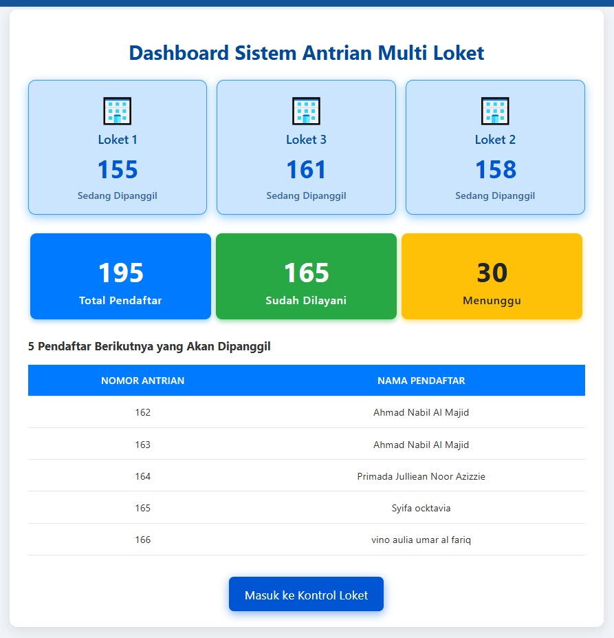

# 🏫 Sistem Antrian Multi-Loket PSB

[](https://php.net/)
[](https://mysql.com/)
[](LICENSE)

Sistem manajemen antrian digital untuk **Penerimaan Siswa Baru (PSB)** yang mendukung multiple loket dengan notifikasi WhatsApp real-time. Dirancang untuk meningkatkan efisiensi dan mengurangi antrian fisik di institusi pendidikan.



## ✨ Fitur Utama

### 🏢 Multi-Loket Management
- Mengelola hingga 6 loket secara bersamaan
- Sistem pemanggilan nomor tanpa tumpang tindih
- Status real-time untuk setiap loket

### 📱 Notifikasi WhatsApp
- Notifikasi otomatis saat nomor antrian dipanggil
- Informasi detail loket tujuan
- Konfirmasi pendaftaran dengan nomor antrian

### 📊 Dashboard Real-time
- Monitoring status antrian secara langsung
- Statistik pendaftar (total, dilayani, menunggu)
- Public display untuk ruang tunggu

### 🔄 Integrasi Google Sheets
- Sinkronisasi otomatis data pendaftar
- Backup data harian
- Import data dari formulir online

### 👨‍💼 Panel Admin
- Manajemen data pendaftar
- Update status manual
- Sistem pencarian dan filter
- Reset harian dengan backup otomatis

## 🛠️ Tech Stack

- **Backend**: PHP 7.4+
- **Database**: MySQL 5.7+
- **Frontend**: HTML5, JavaScript ES6, Tailwind CSS
- **APIs**: Google Sheets API, WhatsApp API
- **Libraries**: cURL, MySQLi

## 📁 Struktur Project

```
├── index.php                 # Landing page
├── config.php                # Konfigurasi database & API
├── functions.php             # Helper functions
├── sync.php                  # Sinkronisasi Google Sheets
├── dashboard.php             # Dashboard utama
├── dashboard_public.php      # Display publik
├── dashboard_api.php         # API endpoint dashboard
├── login_loket.php           # Login loket
├── control.php               # Kontrol panel loket
├── admin_login.php           # Login admin
├── admin.php                 # Panel admin
├── logout.php                # Logout loket
├── logout_admin.php          # Logout admin
└── status_api.php            # API status antrian
```

## 🚀 Instalasi

### Prerequisites
- PHP 7.4 atau lebih tinggi
- MySQL 5.7 atau lebih tinggi
- Web server (Apache/Nginx)
- Google Sheets API credentials
- WhatsApp API credentials

### Langkah Instalasi

1. **Clone repository**
```bash
git clone https://github.com/classyid/multi-loket-queue-system.git
cd multi-loket-queue-system
```

2. **Setup Database**
```sql
CREATE DATABASE loketpsb;
USE loketpsb;

CREATE TABLE pendaftar (
    id INT PRIMARY KEY AUTO_INCREMENT,
    nama VARCHAR(255) NOT NULL,
    whatsapp VARCHAR(20) NOT NULL,
    timestamp DATETIME NOT NULL,
    nomor_antrian INT NOT NULL,
    status ENUM('waiting', 'called', 'done') DEFAULT 'waiting',
    loket_id VARCHAR(50) DEFAULT NULL
);

CREATE TABLE log_whatsapp (
    id INT PRIMARY KEY AUTO_INCREMENT,
    nomor_pendaftar VARCHAR(20) NOT NULL,
    message TEXT NOT NULL,
    status ENUM('success', 'failed') NOT NULL,
    response_msg TEXT,
    created_at TIMESTAMP DEFAULT CURRENT_TIMESTAMP
);
```

3. **Konfigurasi**
Edit file `config.php`:
```php
define('GOOGLE_SHEET_API_URL', 'YOUR_GOOGLE_SHEETS_API_URL');
define('API_KEY', 'YOUR_WHATSAPP_API_KEY');
define('SENDER', 'YOUR_WHATSAPP_SENDER_NUMBER');

define('DB_HOST', 'localhost');
define('DB_USER', 'your_db_user');
define('DB_PASS', 'your_db_password');
define('DB_NAME', 'loketpsb');
```

4. **Setup Google Sheets API**
- Buat Google Apps Script untuk API endpoint
- Deploy sebagai web app dengan akses publik
- Masukkan URL ke konfigurasi

5. **Setup WhatsApp API**
- Daftar ke provider WhatsApp API
- Dapatkan API key dan sender number
- Masukkan credentials ke konfigurasi

## 💡 Penggunaan

### Untuk Operator Loket
1. Akses `/login_loket.php`
2. Pilih loket yang akan dioperasikan
3. Gunakan tombol "Panggil Nomor Berikutnya" untuk memanggil antrian

### Untuk Admin
1. Akses `/admin_login.php`
2. Login dengan credentials admin
3. Kelola data pendaftar dan lakukan reset harian

### Untuk Publik
- Akses `/dashboard_public.php` untuk melihat status antrian
- Akses `/dashboard.php` untuk monitoring lengkap

## 🔧 Konfigurasi Lanjutan

### Menambah Jumlah Loket
Edit array `$loket_list` di `login_loket.php`:
```php
$loket_list = [
    'loket_1' => 'Loket 1',
    'loket_2' => 'Loket 2',
    // Tambahkan loket baru
    'loket_7' => 'Loket 7',
];
```

### Kustomisasi Pesan WhatsApp
Edit function `sendWhatsappMessage()` di `functions.php` untuk menyesuaikan template pesan.

### Jadwal Sinkronisasi Otomatis
Setup cron job untuk menjalankan `sync.php`:
```bash
# Sinkronisasi setiap 5 menit
*/5 * * * * /usr/bin/php /path/to/project/sync.php
```

## 📊 API Endpoints

- `GET /dashboard_api.php` - Data dashboard utama
- `GET /status_api.php` - Status antrian current
- `POST /sync.php` - Manual sync dari Google Sheets

## 🔒 Keamanan

- Session-based authentication
- SQL injection protection dengan prepared statements
- Input sanitization dan validation
- HTTPS recommended untuk production

## 🤝 Kontribusi

1. Fork repository
2. Buat feature branch (`git checkout -b feature/AmazingFeature`)
3. Commit changes (`git commit -m 'Add some AmazingFeature'`)
4. Push to branch (`git push origin feature/AmazingFeature`)
5. Buat Pull Request

## 📝 Changelog

### v1.0.0 (2025-01-01)
- ✨ Initial release
- 🏢 Multi-loket queue management
- 📱 WhatsApp notifications
- 📊 Real-time dashboard
- 👨‍💼 Admin panel

## 📄 License

Distributed under the MIT License. See `LICENSE` for more information.

## 👨‍💻 Author

- Email: kontak@classy.id

## 🙏 Acknowledgments

- [Tailwind CSS](https://tailwindcss.com/) untuk styling
- [Font Awesome](https://fontawesome.com/) untuk icons
- Google Sheets API untuk integrasi data
- WhatsApp MPedia API untuk notifikasi

---

⭐ Jika project ini membantu, jangan lupa berikan star!
